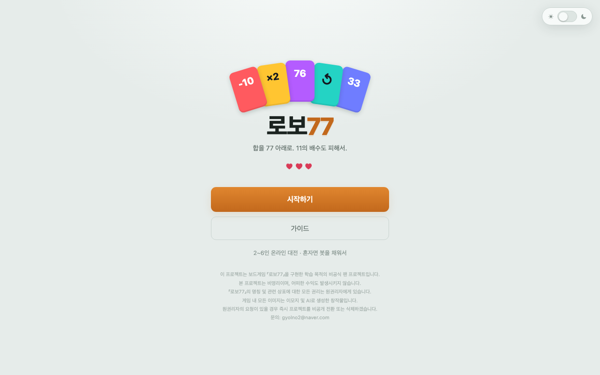

# 로보77

합을 계속 더해 가다가 **77 이상**이 되거나 **11의 배수**를 밟으면 하트를 잃는 온라인 카드 게임입니다.



## 플레이

https://robo77.41ways.workers.dev/

2~6인. 사람이 모자라면 봇으로 채워서 혼자서도 할 수 있습니다.

## 규칙

카드 5장과 하트 3개로 시작합니다. 돌아가며 카드를 한 장씩 내고, 낸 숫자가 하나의 합에 계속 쌓입니다. 합이 77 이상이 되거나 11의 배수(11·22·33·44·55·66)가 되면 하트를 하나 잃고 그 라운드가 끝납니다. 하트를 다 잃어도 계속하다가, 하트 0인 상태에서 또 잃으면 탈락입니다.

카드 중에는 `-10`(10을 뺀다), `76`(그대로 더한다), `×2`(다음 사람이 두 장을 내야 한다), 방향전환처럼 합을 흔드는 특수 카드가 섞여 있습니다.

대기실에서 합을 화면에 보여줄지 가릴지 고를 수 있습니다. 가리면 맨 위 카드 한 장만 보이고 머릿속으로 계속 더해야 합니다.

## 기술

정적 화면(`public/`)은 Cloudflare Workers 자산으로, 게임 로직은 Durable Object 하나가 웹소켓으로 처리합니다. 로컬 개발은 Node(`server.js`)로 같은 `game.js`를 띄웁니다.

```bash
npm install
npm start        # http://localhost:8790
npm test
```

배포:

```bash
npx wrangler deploy
```

## 저작권

보드게임 『로보77』을 구현한 학습 목적의 비공식 팬 프로젝트입니다. 비영리이며 수익을 발생시키지 않습니다. 명칭과 상표에 대한 권리는 원권리자에게 있고, 게임 내 이미지는 이모지 및 AI로 만든 창작물입니다. 원권리자의 요청이 있으면 즉시 비공개 전환 또는 삭제합니다. 문의: gyolno2@naver.com
